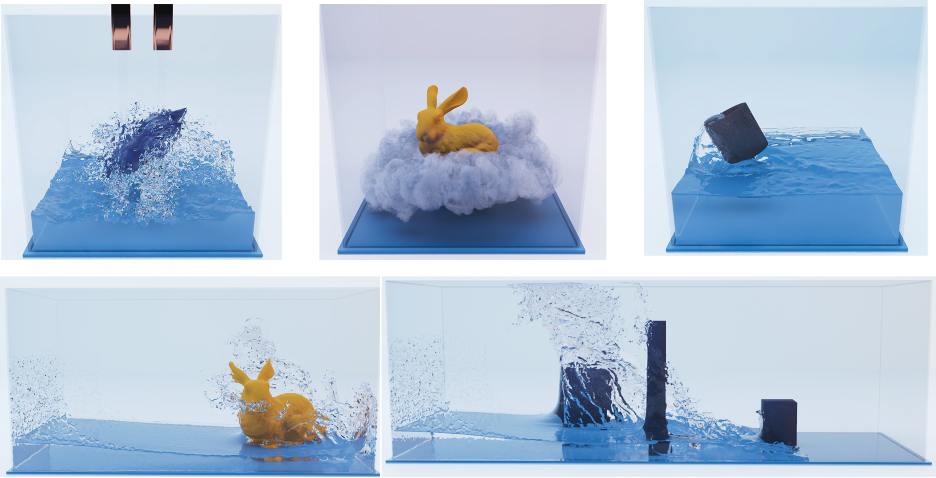

# A Neural-preconditioned Poisson Solver for Mixed Dirichlet and Neumann Boundary Conditions (ICML 2024)


This is the codebase for our paper: https://arxiv.org/abs/2310.00177.

Here is an intro video about our project: https://youtu.be/Z1fQoe66YN0?si=5oYr5FdXSeEK4lk-.


## Requirements and dependencies
* Python.
* [Pytorch](https://pytorch.org/get-started/locally/) > 2.0.
* [CUDA Tookit](https://developer.nvidia.com/cuda-downloads) required.
* [Boost](https://www.boost.org/): required by AMGCL
* `git submodule update --init --recursive` should register the following submodules in `cxx_src` folder:
    * [AMGCL](https://github.com/ddemidov/amgcl).
    * [AMGX](https://github.com/NVIDIA/AMGX).
    * [VexCL](https://github.com/ddemidov/vexcl).
    * [PyBind11](https://github.com/pybind/pybind11).

* Download [eigen 3.4](https://eigen.tuxfamily.org/index.php?title=Main_Page) into the project folder, and name it `eigen-3.4.0`.
* [CuPy](https://cupy.dev/) for CUDA implementation of CG.
* [SciPy](https://scipy.org/) for linear algebra support.
* [Ninja](https://ninja-build.org/) required to load Torch C++ extension.

We recommend using a virtual environment such as `conda`.

# Setup
In order to test `AMGCL` or `IC`, you need to do the following inside `cxx_src` folder, :
```
    mkdir build && cd build
    cmake .. -GNinja
    ninja
```
In order to test `AMGX`, follow the instructions on [here](https://github.com/NVIDIA/AMGX) to build the project. Then inside `cxx_src/pyamgx`, run
```
pip install .
```

## Testing
Download test data and trained model from [here](https://drive.google.com/file/d/1HvPYeFbw34-esAd6Lk5LaQu4w2DuFUMq/view?usp=drive_link).

Inside the project folder, unzip it, and you should expect the following files:
```
data/dambreak_pillars_N128_N256_200_3D/div_v_star_200.bin
data/dambreak_pillars_N128_N256_200_3D/A_200.bin
data/dambreak_pillars_N128_N256_200_3D/flags_200.bin
data/smoke_bunny_N256_200_3D/div_v_star_200.bin
data/smoke_bunny_N256_200_3D/A_200.bin
data/smoke_bunny_N256_200_3D/flags_200.bin
data/smoke_solid_N128_200_3D/div_v_star_200.bin
data/smoke_solid_N128_200_3D/A_200.bin
data/smoke_solid_N128_200_3D/flags_200.bin
data/waterflow_ball_N256_200_3D/div_v_star_200.bin
data/waterflow_ball_N256_200_3D/A_200.bin
data/waterflow_ball_N256_200_3D/flags_200.bin
output/output_3D_128/checkpt_mixedBCs_M11_ritz1600_rhs800_l5_trilinear_25.tar
output/output_3D_128/checkpt_mixedBCs_M11_ritz1600_rhs800_l4_trilinear_62.tar
```
Extra test data can be downloaded from [here](https://drive.google.com/drive/folders/1fHS-YIAZSanBbc5bFn7q1SR9I8kibyhI?usp=drive_link).

Run the test with
```
python test.py
```
The first time will be slow, as the PyTorch CUDA extension is compiled.

## Training

The original data were generated by physics-based simulation with our private fluid solver (more details in our paper). The preprocessed data, including the matrix, cell markers, and rhs can be accessed [here](https://drive.google.com/drive/folders/11Pjzf0Z6fKjv-Hk9BdOgvgyuy1EusEuX?usp=sharing).

The following data were used for training:

Scene | frames
--- | ---
`dambreak_N128_200_3D` |  1,  23,  45,  67,  89, 111, 133, 155, 177, 200
`dambreak_hill_N128_N256_200_3D` |  1,  23,  45,  67,  89, 111, 133, 155, 177, 200
`dambreak_dragons_N128_N256_200_3D` | 1, 6, 10, 15, 21, 35, 44, 58, 81, 101, 162, 188
`ball_cube_N128_200_3D` | 23,  45,  67,  89, 111, 133, 155, 177, 200
`ball_bowl_N128_200_3D` | 23,  45,  67,  89, 111, 133, 155, 177, 200
`standing_dipping_block_N128_200_3D` | 23,  45,  67,  89, 111, 133, 155, 177, 200
`standing_rotating_blade_N128_200_3D` | 1, 23,  45,  67,  89, 111, 133, 155, 177, 200
`waterflow_pool_N128_200_3D` | 23,  45,  67,  89, 111, 133, 155, 177, 200
`waterflow_panels_N128_200_3D` | 23,  45,  67,  89, 111, 133, 155, 177, 200
`waterflow_rotating_cube_N128_200_3D` | 23,  45,  67,  89, 111, 133, 155, 177, 200
`smoke_moving_donuts_N128_200_3D` | 10,  31,  52,  73,  94, 115, 136, 157, 178, 200


All data except `dambreak_hill_N128_N256_200_3D` have ritez vectors that can be used to generate rhs vectors by `preprocess.py`. For `dambreak_hill_N128_N256_200_3D`, the ritzvector file was lost, but rhs vectors have been generated for you. After preprocessing, your data should contain `A_*.pt`, `b_*.pt`. `flags_binary_3.pt`.

Run `train.py` to train the model. Adjust the parameters if necessary.
